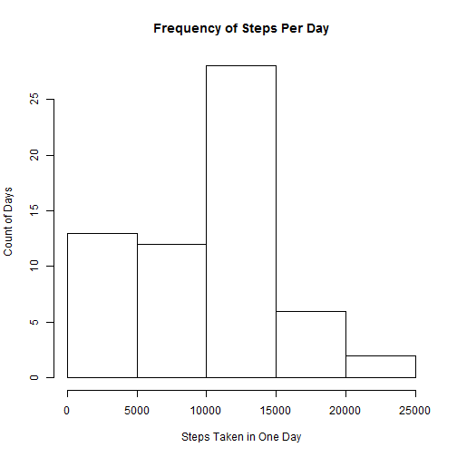
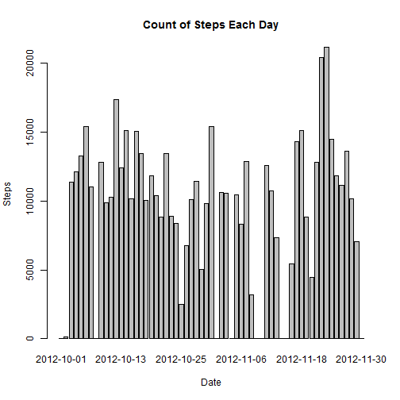
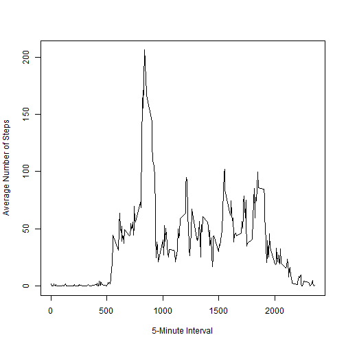
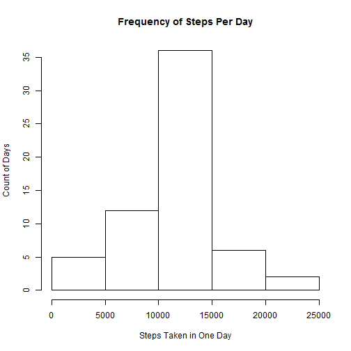
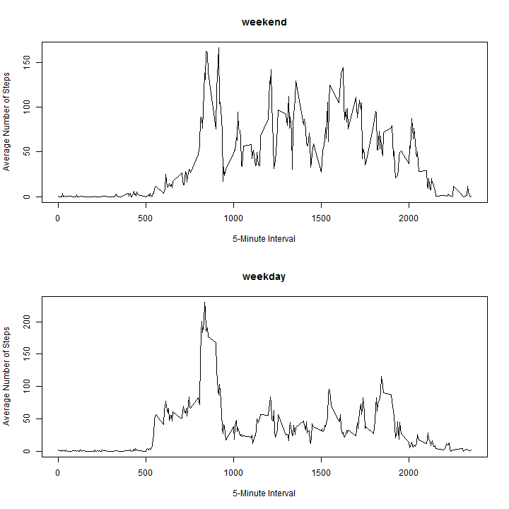

# Reproducible Research: Peer Assessment 1


## Loading and preprocessing the data

The original data archive is available in this repo. Unzip it and read the
CSV into the data variable.


```r
data <- read.csv(unz("E:/GitHub/RepData_PeerAssessment1/activity.zip", "activity.csv"))
```


## What is mean total number of steps taken per day?

*For this part of the assignment, we ignore the missing values in the dataset.*

1. *Make a histogram of the total number of steps taken each day*


```r
hist(tapply(data$steps, data$date, sum, na.rm = TRUE), main = "Frequency of Steps Per Day", 
    xlab = "Steps Taken in One Day", ylab = "Count of Days")
```

 


We may also want to see the number of steps taken on each day:


```r
barplot(tapply(data$steps, data$date, sum, na.rm = TRUE), main = "Count of Steps Each Day", 
    xlab = "Date", ylab = "Steps")
```

 


2. *Calculate and report the mean and median total number of steps taken per day*

Mean number of steps taken per day:


```r
mean(tapply(data$steps, data$date, sum, na.rm = TRUE))
```

```
## [1] 9354
```


Median number of steps taken per day:


```r
median(tapply(data$steps, data$date, sum, na.rm = TRUE))
```

```
## [1] 10395
```


## What is the average daily activity pattern?


1. *Make a time series plot (i.e. `type = "l"`) of the 5-minute interval (x-axis) and the average number of steps taken, averaged across all days (y-axis)*


```r
intervalAverages <- tapply(data$steps, data$interval, mean, na.rm = TRUE)

plot(names(intervalAverages), intervalAverages, type = "l", xlab = "5-Minute Interval", 
    ylab = "Average Number of Steps")
```

 


2. *Which 5-minute interval, on average across all the days in the dataset, contains the maximum number of steps?*


```r
names(intervalAverages)[which.max(intervalAverages)]
```

```
## [1] "835"
```


## Imputing missing values


1. *Calculate and report the total number of missing values in the dataset (i.e. the total number of rows with NAs)*


```r
sum(is.na(data$steps))
```

```
## [1] 2304
```


2. *Devise a strategy for filling in all of the missing values in the dataset. The strategy does not need to be sophisticated. For example, you could use the mean/median for that day, or the mean for that 5-minute interval, etc.*

We now replace NA's found in the steps column with the mean for the 5-minute
interval from other days. That is, we look up the interval average and replace
NA's with that value.

3. *Create a new dataset that is equal to the original dataset but with the missing data filled in.*

The one tricky part is that data$interval is an integer yet we want to look up
the value in intervalAverages by string. So we need the as.character conversion.

Before:


```r
data[100:110, ]
```

```
##     steps       date interval
## 100    NA 2012-10-01      815
## 101    NA 2012-10-01      820
## 102    NA 2012-10-01      825
## 103    NA 2012-10-01      830
## 104    NA 2012-10-01      835
## 105    NA 2012-10-01      840
## 106    NA 2012-10-01      845
## 107    NA 2012-10-01      850
## 108    NA 2012-10-01      855
## 109    NA 2012-10-01      900
## 110    NA 2012-10-01      905
```

```r
completeData <- data
completeData$steps <- ifelse(is.na(completeData$steps), intervalAverages[as.character(completeData$interval)], 
    completeData$steps)
```


After:


```r
completeData[100:110, ]
```

```
##     steps       date interval
## 100 157.5 2012-10-01      815
## 101 171.2 2012-10-01      820
## 102 155.4 2012-10-01      825
## 103 177.3 2012-10-01      830
## 104 206.2 2012-10-01      835
## 105 195.9 2012-10-01      840
## 106 179.6 2012-10-01      845
## 107 183.4 2012-10-01      850
## 108 167.0 2012-10-01      855
## 109 143.5 2012-10-01      900
## 110 124.0 2012-10-01      905
```


4. *Make a histogram of the total number of steps taken each day and Calculate and report the mean and median total number of steps taken per day.*


```r
hist(tapply(completeData$steps, completeData$date, sum, na.rm = TRUE), main = "Frequency of Steps Per Day", 
    xlab = "Steps Taken in One Day", ylab = "Count of Days")
```

 


*Do these values differ from the estimates from the first part of the assignment? What is the impact of imputing missing data on the estimates of the total daily number of steps?*

Yes, the missing values do have an impact on the analysis. They skewed the
results lower than what we would estimate to be the true value.

## Are there differences in activity patterns between weekdays and weekends?

1. *Create a new factor variable in the dataset with two levels - "weekday" and "weekend" indicating whether a given date is a weekday or weekend day.*


```r
# This function takes a string, converts it to a date, and returns whether
# that date is a 'weekday' or a 'weekend'.
DayType <- function(str) {
    day <- weekdays(as.Date(str))
    
    if (day == "Saturday" | day == "Sunday") {
        dayType <- "weekend"
    } else {
        dayType <- "weekday"
    }
    
    dayType
}

# Create a new factor column with the day type (weekday or weekend)
completeData <- cbind(completeData, daytype = sapply(completeData$date, DayType))
```


Sample data after the update:


```r
completeData[1435:1445, ]
```

```
##      steps       date interval daytype
## 1435     0 2012-10-05     2330 weekday
## 1436     0 2012-10-05     2335 weekday
## 1437     0 2012-10-05     2340 weekday
## 1438     0 2012-10-05     2345 weekday
## 1439     0 2012-10-05     2350 weekday
## 1440     0 2012-10-05     2355 weekday
## 1441     0 2012-10-06        0 weekend
## 1442     0 2012-10-06        5 weekend
## 1443     0 2012-10-06       10 weekend
## 1444     0 2012-10-06       15 weekend
## 1445     0 2012-10-06       20 weekend
```


2. *Make a panel plot containing a time series plot (i.e. type = "l") of the 5-minute interval (x-axis) and the average number of steps taken, averaged across all weekday days or weekend days (y-axis).*


```r
par(mfrow = c(2, 1))

weekendSubset <- subset(completeData, daytype == "weekend")
weekendAverages <- tapply(weekendSubset$steps, weekendSubset$interval, mean, 
    na.rm = TRUE)

plot(names(weekendAverages), weekendAverages, type = "l", main = "weekend", 
    xlab = "5-Minute Interval", ylab = "Average Number of Steps")

weekdaySubset <- subset(completeData, daytype == "weekday")
weekdayAverages <- tapply(weekdaySubset$steps, weekdaySubset$interval, mean, 
    na.rm = TRUE)

plot(names(weekdayAverages), weekdayAverages, type = "l", main = "weekday", 
    xlab = "5-Minute Interval", ylab = "Average Number of Steps")
```

 


On average, the subject is much more active early in the day on weekdays and
then settles into low activity during the day. On weekends he/she eases into
the day but averages more activity throught the day. Very interesting...
